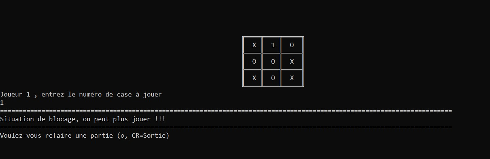

# Jeu du Morpion en Java - Version Console

## Ce jeu est un T.P pour les 1ere Année Dev 

### Java POO

### Junit pour tester le modèle et le comportement

### Packagine automatisé avec utilisation de Maven & Ant

## Installations
    - Telechargez la version correspondante à votre système 
    - Dezippez dans un répertoire 
    - Lancez le script morpion (.bat|.sh) en fonction de votre système

[download windows install](https://github.com/tarhack/morpion/tree/main/builds/install_windows.zip)  
[download Linux/mac install](https://github.com/tarhack/morpion/tree/main/builds/install_mac_linux.zip)

### Rappel des règles du jeu

- le premier joueur à réaliser une ligne, une colonne ou une diagonale sur jeu à gagné
- Chaque joueur joue à son tour, une case déjà jouée ne peut plus être rejouée
- Il est possible que les deux joueurs se neutralisent dans ce cas la partie s'arrête

- ### Le joueur 1 qui gagne car il a réalisé une diagonale
- 
- - ### Le joueur 2 qui gagne car il a réalisé une ligne
- 
- ### Les deux joueurs se sont neutralisé, aucun gagnant !
- 